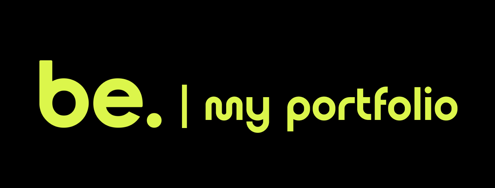

# Be Academy - Exemplo de Portfolio

## Demo: https://capelaum-beacademy-myportfolio.netlify.app

## Libs Externas

- [Scroll Reveal][scrollrevealjs]

## Layout

Pode-se checar o layout no figma por meio desse [link][figma]

## Créditos

Layout criado por [@lnmont][lnmont], neste [repositório][repo].

[figma]: https://www.figma.com/file/0KKO9jUFrQWt80ARBWHGJ9/Portf%C3%B3lio-be.academy-(Copy)?node-id=1%3A3
[lnmont]: https://github.com/lnmont
[repo]: https://github.com/lnmont/beacademy-devstart-frontend-myportfolio
[scrollrevealjs]: https://scrollrevealjs.org
